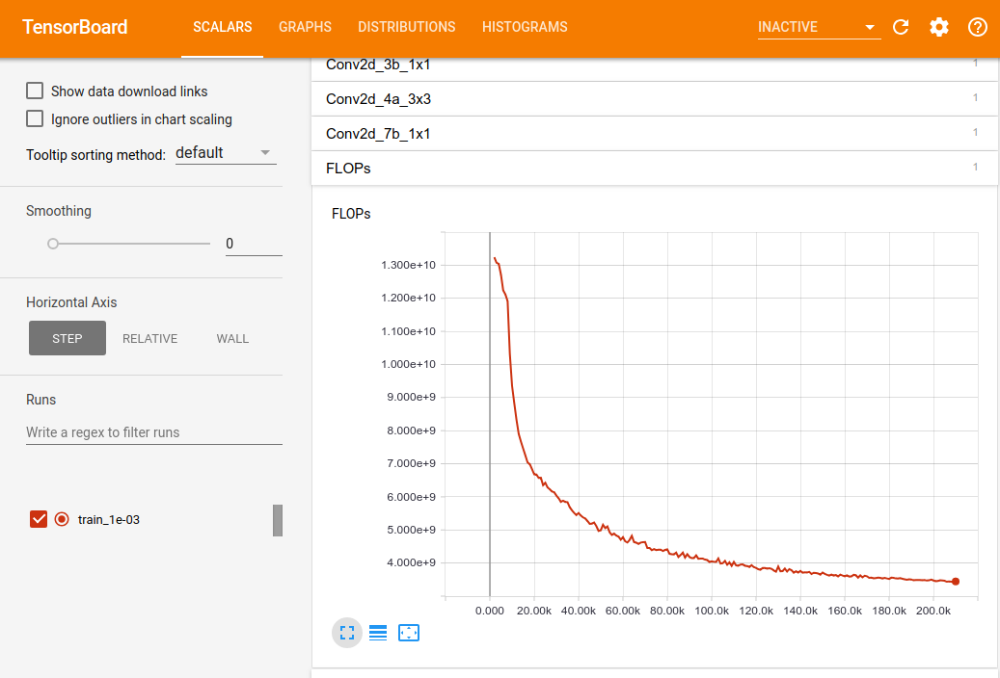

# MorphNet: Fast & Simple Resource-Constrained Learning of Deep Network Structure

[TOC]

## What is MorphNet?

MorphNet is a method for learning deep network structure during training. The
key principle is continuous relaxation of the network-structure learning
problem. Specifically, activation sparsity is induced by adding regularizers
that target the consumption of specific resources such as FLOPs or model size.
When the regularizer loss is added to the training loss and their sum is
minimized via stochastic gradient descent or a similar optimizer, the learning
problem becomes a constrained optimization of the structure of the network,
under the constraint represented by the regularizer. The method is described in
detail in the paper "[MorphNet: Fast & Simple Resource-Constrained Learning of
Deep Network Structure](https://arxiv.org/abs/1711.06798)", published at
[CVPR 2018](http://cvpr2018.thecvf.com/).

## Usage

We assume you start from a working convolutional network. MorphNet will discover
and propose for your review a new network structure, which will differ from the
original only by the number of output channels of various layers.

To apply MorphNet method, you would add a new regularizer during training. The
regularizer pushes certain weights down, with the idea that once they are small
enough, the corresponding channels can be removed from the network. While the
training is going on, MorphNet will periodically save JSON files with the
proposed network structure (i.e., the proposed channel counts for each layer).
As it takes time to reduce the weights, you would normally see the proposed
output counts go down as the step count increases. You would typically wait for
the training to converge, or at least to stabilize to some degree.

Once you obtained the proposed network structure, you would modify your model to
use the new channel counts, and run the training again, from scratch. This
second round of training is required because removing the output channels with
small weights is still a meaningful modification to the network.

We refer to the first round of training as the **structure learning**, and the
second round of training as the **retraining**.

There are several hyperparameters you need to choose for the structure learning
phase:

*   MorphNet NetworkRegularizer (see section below).
*   Regularization strength, which is a multiplicative factor applied to
    MorphNet regularization loss. We recommend a full search through a wide
    range of values, with adjacent values separated by a factor of ~1.5-2.0.
*   Learning rate schedule. We recommend using a relatively low fixed learning
    rate.
*   Threshold that decides how low the weights need to be before MorphNet
    proposes to remove the corresponding output channel. The exact semantics of
    the threshold (i.e., whether it applies to the weight norm, or batch norm
    gamma, etc.) depends on the regularizer type.

The retraining phase should use the exact same hyperparameters you use for the
normal training.

In addition, depending on your ultimate goal, you may linearly expand the
network before or after the structure learning phase. This way, you will end up
with roughly the same network size as without MorphNet, but (hopefully) better
accuracy.

## Regularizer Types

Regularizer classes can be found under ```network_regularizers/``` directory.
They are named by the algorithm they use and the target cost they attempt to
minimize. For example, ```GammaFlopsRegularizer``` uses the batch norm gamma in
order to regularize the FLOP cost.

### Regularizer Algorithms

*GroupLasso* is designed for models without batch norm. *Gamma* is designed for
models with batch norm; it requires that batch norm scale is enabled.

### Regularizer Target Costs

*Flops* optimizes the estimated FLOP count of the inference network.

*Model Size* optimizes the parameter count (number of weights) of the
network.

*Latency* optimizes for the estimated inference latency of the network, based on
the provided hardware.

## Code Examples

### Adding a MorphNet Regularizer

Most of the MorphNet logic is inside the NetworkRegularizer object. Each
NetworkRegularizer represents a resource that we wish to target/constrain when
optimizing the network, as well as an algorithm that performs this optimization.
To apply MorphNet regularizer, the code would look similar to the example below.
The example refers to a specific type of NetworkRegularizer that targets FLOPs
(other regularizer types are available through the same library).

```python
from morph_net.network_regularizers import flop_regularizer
from morph_net.tools import structure_exporter

logits = build_model()

network_regularizer = flop_regularizer.GammaFlopsRegularizer(
    [logits.op], gamma_threshold=1e-3)
regularization_strength = 1e-10
regularizer_loss = (
    network_regularizer.get_regularization_term() * regularization_strength)

model_loss = tf.nn.sparse_softmax_cross_entropy_with_logits(labels, logits)

optimizer = tf.train.MomentumOptimizer(learning_rate=0.01, momentum=0.9)

train_op = optimizer.minimize(model_loss + regularizer_loss)
```

You should monitor the progress of structure learning training via Tensorboard.
In particular, you should consider adding a summary that computes the current
MorphNet regularization loss and the cost if the currently proposed structure
is adopted.

```python
tf.summary.scalar(
              'RegularizationLoss',
              network_regularizer.get_regularization_term() *
              regularization_strength)
tf.summary.scalar(network_regularizer.cost_name,
                  network_regularizer.get_cost())
```



Larger values of `regularization_strength` will converge to smaller effective
FLOP count. If `regularization_strength` is large enough, the FLOP count will
collapse to zero. Conversely, if it is small enough, the FLOP count will remain
at its initial value and the network structure will not vary. The
`regularization_strength` parameter is your knob to control where you want to be
on the price-performance curve. The `gamma_threshold` parameter is used for
determining when an activation is alive.

### Extracting the Architecture Learned by MorphNet

During training, you should save a JSON file that contains the learned structure
of the network, that is the count of activations in a given layer kept alive (as
opposed to removed) by MorphNet.

```python
exporter = structure_exporter.StructureExporter(
    network_regularizer.op_regularizer_manager)

with tf.Session() as sess:
  tf.global_variables_initializer().run()
  for step in range(max_steps):
    _, structure_exporter_tensors = sess.run([train_op, exporter.tensors])
    if (step % 1000 == 0):
      exporter.populate_tensor_values(structure_exporter_tensors)
      exporter.create_file_and_save_alive_counts(train_dir, step)
```

## Misc

Contact: morphnet@google.com

### Maintainers

*   Elad Eban, github: [eladeban](https://github.com/eladeban)
*   Andrew Poon
*   Yair Movshovitz-Attias
*   Max Moroz

### Contributors

*   Ariel Gordon, github: [gariel-google](https://github.com/gariel-google).
